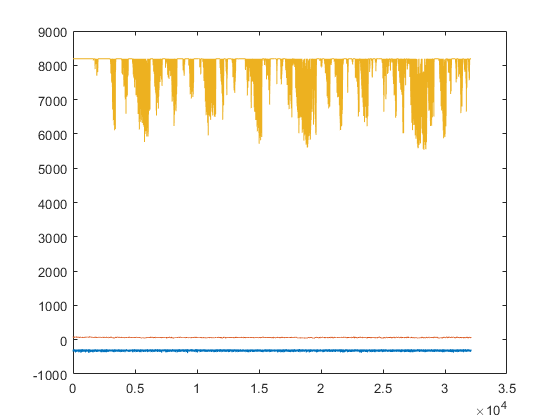

# 1. Load raw data
{: .no_toc }

## Table of contents
{: .no_toc .text-delta }

1. TOC
{:toc}

---

## Read in imaging data in Matlab

### Loading ScanImage TIFF files

Each arm of the Duopus (dual-axis) microscope is controlled by ScanImage. Thus, the data is saved in [ScanImage TIFF format](http://scanimage.vidriotechnologies.com/display/SI2019/Output+Files).

The TIFF data can be loaded into the Matlab workspace by:
```
>> M = load_scanimage_tif('ctx_00001.tif');
```
where `'ctx_00001.tif'` is the filename of the TIFF file. The PC needs to have, of course, enough RAM to load the entire movie into memory.

### Loading Bruker / Prairie TIFF files

Bruker microscopes (formerly Prairie) saves individual frames as separate TIF files, where each file contains exactly one image. Thus, I recommend grouping all the saved images of a single acquisition in a single directory.

Suppose that the TIF files of a single acquisition is saved in a folder called `p1_Data`. The most basic way to load Prairie data into the Matlab workspace is as follows:
```
>> M = load_prairie_tif('p1_Data');
26-Nov-2019 11:17:49: Looking for files matching "*.tif" in directory "p1_Data"... Found 300 images!
```
The above simply loads all TIF files (i.e. matching the pattern `*.tif`) into a single movie matrix `M`. The frames are ordered in ascending alphabetical order according to their filename.

The function `load_prairie_tif` can accept additional arguments to specify a _subset_ of TIF files to load from a directory. For example, suppose that the folder `p3_Data` contains volumetric (e.g. 3 planes per volume), multi-channel data. Then,
```
>> M = load_prairie_tif('p3_Data', 'ch', 1, 'slice', 2);
26-Nov-2019 11:20:59: Looking for files matching "*_Ch1_000002.*.tif" in directory "p3_Data"... Found 300 images!
```
loads images from channel 1, and the second slice of each volume.

It's also possible to load different subsets, e.g.:
```
>> M = load_prairie_tif('p3_Data', 'slice', 2);
26-Nov-2019 11:22:23: Looking for files matching "*_000002.*.tif" in directory "p3_Data"... Found 600 images!
```
loads the second slice of each volume, but for both channels. (The channels alternate in the matrix `M`, since that is their alphabetical order according to their filename.)

Similarly,
```
>> M = load_prairie_tif('p3_Data', 'ch', 1);
26-Nov-2019 11:24:35: Looking for files matching "*_Ch1_*.tif" in directory "p3_Data"... Found 900 images!
```
loads all channel 1 frames.

---

## Inspect the movie's fluorescence values

Next, I like to start by inspecting the fluorescence values of the movie: namely, for each frame the minimum, average, and maximum pixel values. This is performed as follows:
```
>> F = compute_fluorescence_stats(M);
09-Jul-2019 14:58:29: Frames 2500 of 32100 examined...
...
09-Jul-2019 14:59:06: Frames 30000 of 32100 examined...
```
The output matrix `F` is a `[num_frames x 3]` matrix where:

- The first column is the minimum pixel value over the frame;
- The second column is the average pixel value over the frame;
- And the third column is the maximum pixel value over the frame.

These fluorescence values can be visualized by:
```
>> plot(F);
```
which yields a plot like the following:



where the x-axis is the frame number (in the example movie there are 32100 frames) and the y-axis is the fluorescence value (a.u., digitized by ScanImage). Here, the minimum trace is blue, the average trace is red, and the max trace is orange.

With the fluorescence plot, I am looking for obvious oddities in the movie. For example, if the PMT were to shut off during acquisition, the min/avg/max traces would all dip to 0 on the y-axis. If there were occluding debris in the imaging path (e.g. "floaters" in the water immersion) or the mouse's tail got in the way, then the traces would show unusual features---especially in the average trace. In this example, there aren't any obvious oddities in the recorded movie.

---

## Correct the non-zero offset of the movie

In the plot of `F` above, it's clear that the "baseline" of the recorded fluorescence is offset from 0. This is not surprising, as the recorded baseline can be offset by arbitrary hardware settings like the bias of the preamplifier. However, for numerical analysis of the movie, I like to "recenter" the baseline to be at 0.

First, convert the movie into `single` format as follows:
```
>> M = single(M);
```

ScanImage acquires images in `int16` format, which is not convenient for (non-integer) arithmetic operations. So, we need to convert to an arithmetic-friendly format (floating point) such as `single`. Note that the size of the movie in memory will increase by two-fold, as a single `int16` number is two bytes, whereas a single `single` number is four bytes.

Next, subtract off the _mean of the minimum fluorescence trace_ as follows:
```
>> M = M - mean(F(:,1));
```

After the non-zero offset has been corrected, the result can be saved onto hard drive as a HDF5 file:
```
>> save_movie_to_hdf5(M,'ctx.hdf5');
```
where `'ctx.hdf5'` is the output file name. After the HDF5 file is created the original TIFF file can be deleted (though I like to store at least one copy _somewhere_ for archival purposes).
