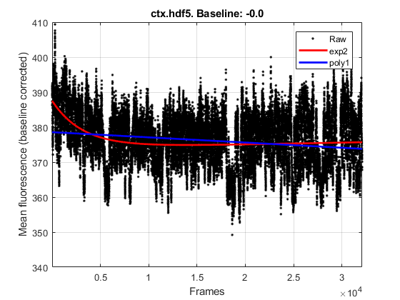

# 2. Preprocess movie
{: .no_toc }

## Table of contents
{: .no_toc .text-delta }

1. TOC
{:toc}

---

## Correct for slow changes in the movie brightness

Over the course of a recording, the brightness of the calcium movie can change (usually a gradual decrease, though not always). This effect can come from light bleaching of the indicator each day, or extraneous factors like the slow loss of immersion fluid.

I correct for the slow changes in movie brightness with the function `meancorr_movie`:
```
>> meancorr_movie('ctx.hdf5', '');
meancorr_movie: Output movie will be saved as "ctx_uc.hdf5"
09-Jul-2019 15:48:06: Examining chunk 1 of 13 from ctx.hdf5...
...
09-Jul-2019 15:49:33: Examining chunk 13 of 13 from ctx.hdf5...
09-Jul-2019 15:49:40: Done!
meancorr_movie: Please select one of following fits:
  1: exp2 (Rsq=0.0936)
  2: poly1 (Rsq=0.0311)
  >> 
```
The function `meancorr_movie` computes the average fluorescence value for each frame, and then attempts to fit a decaying exponential function or a linear function to the measurements. The results are shown in a plot:



where the raw data are black dots, and the fits are shown in red (decaying exponential) or blue (linear fit). For this example, the decaying exponential fit is clearly better, so I type in `1` at the prompt:
```
...
meancorr_movie: Please select one of following fits:
  1: exp2 (Rsq=0.0936)
  2: poly1 (Rsq=0.0311)
  >> 1
Fit selected (exp2)!
09-Jul-2019 15:56:36: Computing mean correction for frames 1 to 2500 (out of 32100)...
...
09-Jul-2019 15:58:11: Computing mean correction for frames 30001 to 32100 (out of 32100)...
09-Jul-2019 15:58:17: Done!
```

When done, `meancorr_movie` generates a new movie file (by default by appending `_uc` to the input filename, _e.g._ `ctx_uc.hdf5` in this example). The original file (_e.g._ `ctx.hdf5`) can be deleted at this point.

---

## Motion correction

Next, run motion correction ([NoRMCorre](https://github.com/flatironinstitute/NoRMCorre)) using the `run_normcorre` "wrapper" function as follows:
```
>> run_normcorre('ctx_uc.hdf5', '');
run_normcorre: Output movie will be saved as "ctx_uc_nc.hdf5"
ctx_uc.hdf5: Nonrigid NC grid size is [128 128] px, with max shift of 50 px
<Some Matlab warnings about temporary variables>
50 out of 32100 frames registered, iteration 1 out of 2 
...

```
Depending on the specs of your analysis machine, the motion correction of a ~32000 frame movie will take a few hours.

The funtion `run_normcorre` generates two new files:

- `ctx_uc_nc.hdf5`: The motion corrected movie ("nc" is short for NoRMCorre),
- `ctx_uc_nc.mat`: Motion correction parameters for each frame. The contents of this MAT file can be used, for example, to correct alternative channels of the same recording.

Note: I would not yet delete the original movie (`ctx_uc.hdf5`) until the motion corrected movie has been manually inspected to be of acceptable quality.

---

## Z-score the movie

Next, we z-score the movie (pixelwise) as follows:
```
>> zscore_movie('ctx_uc_nc.hdf5', '');
```

The function `zscore_movie` first computes, for each pixel, the mean value and the standard deviation over all frames. The "standard deviation image" is then shown, along with a prompt to continue with the z-scoring of the movie. By default, the output file has `_zsc` appended to the filename, _e.g._ `ctx_uc_nc_zsc.hdf5`.

Note: For archival purposes, storing either `ctx_uc_nc.hdf5` or `ctx_uc_nc_zsc.hdf5` is sufficient. It's possible to recover one from the other. I usually store the pre-z-scored movie (_i.e._ `ctx_uc_nc.hdf5`).

---

## Temporally bin the movie

For running cell extraction algorithms (_e.g._ CNMF) and for visual inspection purposes, I like to temporally downsample the movie by averaging every N frames together. Typically, I use N=8 for movies that are ~30k--50k frames long.

The temporal binning is performed by:
```
>> bin_movie_in_time('ctx_uc_nc_zsc.hdf5', '', 8);
```
where the last parameter (8, in the above case) is the number of frames to be averaged. The function `bin_movie_in_time` then generates a new HDF5 file with `_ti8` appended to the name.

__Important: Do not delete the original, non-time-binned movie.__ It is not possible to recover the full temporal resolution from the time-binned movie.
